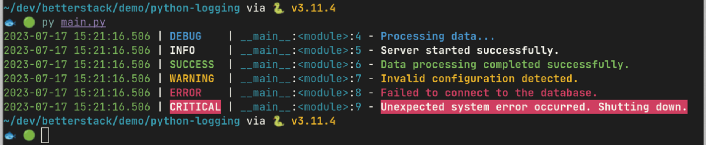
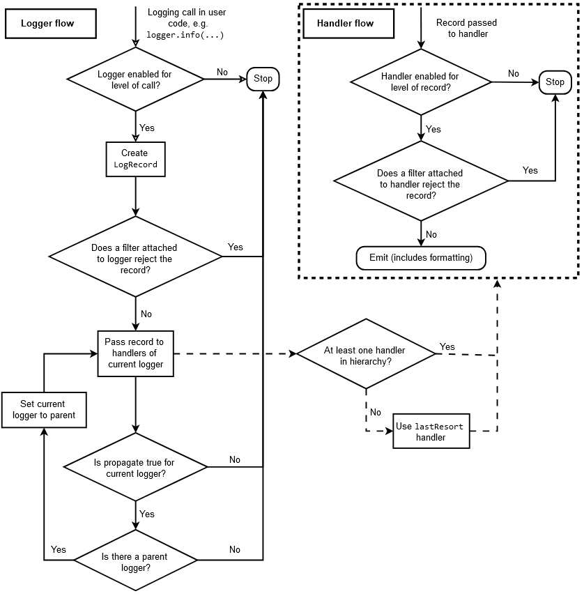
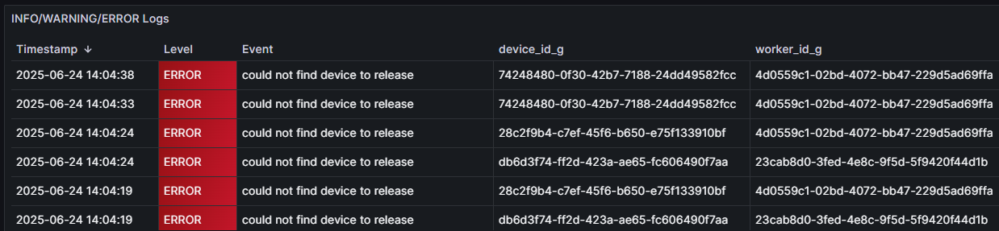
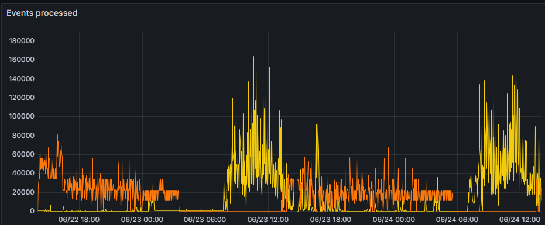

# Bonnes pratiques de logging

Julien Lenormand

Python Meetup de Grenoble - Juin 2025

---

## C'est quoi le "logging" ?

* la "journalisation" en français
* une version surpuissante de "print"
* votre meilleur ami pour débugger dans débuggeur
* un sujet très souvent méconnu

---

## Plus concrètement ?

```python
error while processing the request: ''
```

```python
try:
    ...
except Exception as e:
    print(f"error while processing the request: {e}")
```

---

## La différence ?

```python
[INFO] received request, processing data...
[DEBUG] checking input file 'input_0458z.json'
[ERROR] error while processing the request
Traceback (most recent call last):
  File "main.py", line 107, in check_input
    value_to_check = data[key]
KeyError: ''

The above exception was the direct cause of the following exception:
Traceback (most recent call last):
  File "main.py", line 55, in process_request
    is_valid = check_input(request.json_content)
  File "main.py", line 119, in check_input
    raise ValidationError(f"could not find required {key=!r}") from e
ValidationError: could not find required key=''
```

---

## La base

```python
import logging
logger = logging.getLogger("my-app.main")
logger.debug("...")
logger.info("...")
logger.error("...")
logger.exception("...")
# quelques try-except-else(-finally)
raise Error(...) from e
```

---

## Exemple de rendu par Loguru



---

# Pourquoi c'est important ?

* mon métier c'est devenu le DevOps ♾️
* écrire du code qui fonctionnera sans (trop de) problèmes en prod
* diagnostiquer les problèmes en prod pour les corriger
  * (souvent des POC partis en prod ... 😅)
* le logging a un impact radical sur la capacité à corriger
* je vous partage mes astuces (bonnes pratiques ?)

---

# Mes conseils

---

## Pas de print !!!

* contexte : application en prod (pas un script jetable)
* action : remplacer tous les `print` par des `logger.xxx`
  * règle Ruff à activer : `T201 "print"`
* gains :
  * ajoute du contexte par défaut (niveau de log, logger, ...)
  * formattage standardisé / standardisable
    * `logging.Formatter("%(asctime)s %(levelname)s [%(process)d|%(thread)d] %(name)s - %(message)s")`
    * `2025-06-24 15:06:42,233 ERROR [25656|28776] my-app.main - error while processing the request`
  * thread-safe
  * pilotable (stdout, stderr, collecteur, ...)

---

## Plusieurs flux

* contexte : un gros système
* action : logger différentes parties dans différents fichiers
  * utiliser des logger différents (pas forcément `"__name__"`), avec chacun son `FileHandler`
  * mettre des niveaux de logs différents : `logger.setLevel(logging.DEBUG)`
  * mettre à un même `Logger` différents `Handler`s de niveaux différents : `handler.setLevel(logging.ERROR)`
  * mettre des `Adapter` pour ajouter du contexte spécifique (request id, thread name, ...)
  * mettre des `Filter`s à des `Logger`s et `Handler`s pour trier dynamiquement parmi les messages
* gains :
  * permet de ne pas se noyer dans le bruit (séparation des "concerns")
  * permet d'ajouter l'information nécessaire à chaque contexte
  * permet de varier dynamiquement le config de logging

---

## Machinerie puissante (mais complexe)



---

## Quels logs mettre ?

* contexte : je ne sais pas quels logs mettre
* action :
  * avant de merge, remplacer tous les print par des logger
  * lorsque je dev, si j'ai besoin de comprendre ce qu'il se passe, je rajoute les logs dont j'ai besoin
  * si bug en prod et que les logs ne suffisent pas, j'ajoute ceux qu'il manque
  * si j'en ai trop, j'enlève, ça ne coûte pas cher ...
* gains :
  * l'application comment à être "observable" (elle dit ce qu'elle fait, au lieu d'être une "boîte noire")
  * je debug plus vite (en dev et en prod)

---

# Observabilité

* contexte : je veux aller + loin avec mes logs
* action :
  * mettre en place des métriques et les exposer dans des dashboards
  * définir des seuils et mettre en place des alertes
  * ajouter des traces ("spans") via OpenTelemetry
  * créer des logs "structurés" (JSON, facile à parser)
* gains :
  * une véritable "visibilité" des problèmes (cf slide suivante)
  * une automatisation de la découverte des problèmes
  * le débug facilité entre plusieurs (micro-)services
  * profiter d'un tas d'outils (gratuits ou pas) pour gagner du temps

---

## Exemple de rendu de log structuré



---

## Exemple de graphique



---

# En vrac 🙃

* les `Logger`s forment une hiérarchie, la mécanique globale est très complexe
* il y a des règles de lint (Ruff) sur la perf : osef
  * si on veut faire de la perf, on ne fait pas des apps en Python
  * comme pour tout sujet de perf : mesurer, avant de juger que c'est lent
* pas besoin d'exception pour générer des *stack traces* : `traceback.print_stack()`
* laisser au `main` le soin de setup le logging, ne le faire nul part ailleurs
* pourquoi pas tester les logs qui sont produits ? (comportement observable)
  * `pytest` a une *fixture* `caplog` : `caplog.records` ...

---

# Quelques bêtes erreurs

* la lib `logging` est en CamelCase ... 🐫
* pas de `logging.basicConfig()` en prod, trop basique !
* toujours faire `logger = logging.getLogger(...)` et non pas `logging.Logger()`
* ne pas passer par le logger root :
  * 🙅 `logging.debug/info/warning/error/critical()`
  * 🆗 `logger = logging.getLoger() ; logger.debug(...)`
* attention aux secrets, clés d'API, données soumises au RGPD, ... (comme avec print !)

---

# Conclusion

* ne pas réinventer la roue : délaisser `print` en faveur de `logging`
* exiger d'avoir de la visibilité sur le fonctionnement des applis
* commencer petit, finir loin

---

## Sources

* stdlib Python :
  * [`logging` — Logging facility for Python](https://docs.python.org/3/library/logging.html)
  * [Logging HOWTO](https://docs.python.org/3/howto/logging.html)
  * [Logging Cookbook](https://docs.python.org/3/howto/logging-cookbook.html)
* [Please don't hijack my Python root logger](https://rednafi.com/python/no_hijack_root_logger/)

---

# Interactions ! 🙋

* Questions ?
* Remarques ?
* Doutes ?
* Conseils ?
* ROTI ? 🍖
